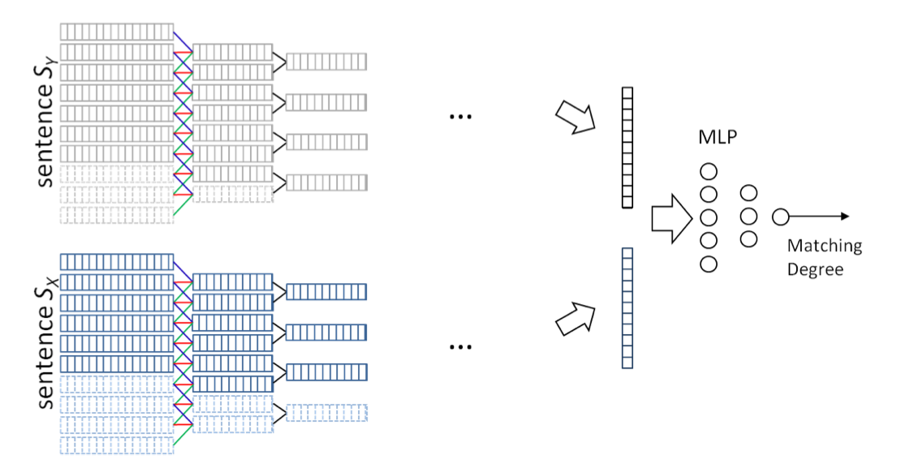

# 实验记录

### 使用 ARCI 模型

| 实验代号 | 训练集acc | 测试集acc | F1 值  | 参数                           | 轮次 | 备注 |
| -------- | --------- | --------- | ------ | ------------------------------ | ---- | ---- |
|          | 0.6813    | 0.6333    |        | english.bin                    |      |      |
|          | 0.6572    | 0.6333    |        | Fasttext word embeeding 不训练 |      |      |
|          | 0.6646    | 0.6310    | 0.6320 | Fasttext word embeeding 训练   |      |      |
|          |           |           |        |                                |      |      |

